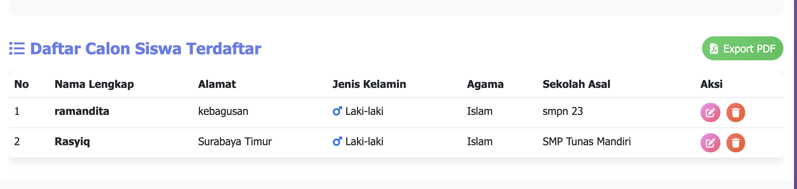

# Sistem Pendaftaran Calon Siswa - SMK Digital 📊

Aplikasi web modern untuk mengelola pendaftaran calon siswa baru menggunakan FastAPI, SQLAlchemy, dan Bootstrap 5. Sistem ini menyediakan fungsi CRUD (Create, Read, Update, Delete) yang lengkap dengan antarmuka yang user-friendly dan **fitur ekspor PDF yang canggih**.

   

## 🎯 Fitur Utama

### ✨ Manajemen Data Siswa
- ➕ **Tambah Data**: Mendaftarkan calon siswa baru dengan form yang lengkap
- 📝 **Edit Data**: Mengubah informasi siswa yang sudah terdaftar
- 🗑️ **Hapus Data**: Menghapus data siswa dengan konfirmasi keamanan
- 📋 **Lihat Data**: Menampilkan daftar lengkap calon siswa dalam tabel interaktif

### 📄 **Fitur Export PDF Terbaru** ⭐
- 🖨️ **Laporan Profesional**: Ekspor seluruh data siswa ke format PDF
- 📊 **Layout Terstruktur**: Tabel yang rapi dengan header dan footer
- 📅 **Timestamp Otomatis**: Setiap laporan diberi tanggal dan waktu pembuatan
- 📈 **Ringkasan Data**: Total jumlah siswa terdaftar
- 💾 **Download Langsung**: File PDF langsung ter-download dengan nama unik
- 🎨 **Desain Profesional**: Format laporan yang siap untuk dokumentasi resmi

### 🎨 Antarmuka Modern
- 📱 **Responsive Design**: Tampilan yang optimal di semua perangkat
- 🌈 **Modern UI**: Menggunakan Bootstrap 5 dengan gradien dan animasi
- 🔍 **User Experience**: Navigasi yang intuitif dan mudah digunakan
- ⚡ **Fast Loading**: Performa yang optimal dengan desain yang ringan

## 📄 **Fitur PDF Export - Detail Lengkap**

### 🔥 **Keunggulan Sistem PDF**

#### **1. Laporan Komprehensif**
- **Header Profesional**: Judul sistem dan nama sekolah
- **Informasi Waktu**: Tanggal pembuatan laporan otomatis
- **Data Lengkap**: Semua informasi siswa dalam format tabel
- **Footer Dokumentasi**: Keterangan sistem pembuat laporan

#### **2. Format Data Terstruktur**
| Kolom PDF | Keterangan |
|-----------|------------|
| No | Nomor urut siswa |
| Nama Lengkap | Nama siswa (dengan truncation otomatis) |
| Alamat | Alamat lengkap (dengan truncation otomatis) |
| Jenis Kelamin | L/P dengan format yang jelas |
| Agama | Agama siswa |
| Sekolah Asal | Asal sekolah (dengan truncation otomatis) |

#### **3. Fitur Teknis PDF**
- **Library**: FPDF2 v2.8.3 (library Python terpercaya)
- **Encoding**: UTF-8 support untuk karakter Indonesia
- **Font**: Helvetica untuk keterbacaan optimal
- **Size**: A4 standard dengan margin yang sesuai
- **Format File**: `laporan_calon_siswa_YYYYMMDD_HHMMSS.pdf`

#### **4. Cara Menggunakan Export PDF**

1. **Akses Dashboard**: Buka `http://localhost:8001`
2. **Tambah Data**: Masukkan beberapa data siswa terlebih dahulu
3. **Klik Export**: Tekan tombol **"Export PDF"** berwarna hijau
4. **Download Otomatis**: File PDF akan ter-download secara otomatis
5. **Buka File**: PDF siap dibuka dan dicetak

### � **Contoh Output PDF**

```
                    Laporan Data Calon Siswa
                           SMK Digital
                        Tanggal: 8 Juli 2025

┌────┬─────────────────┬──────────────────┬────────────────┬─────────┬──────────────────┐
│ No │   Nama Lengkap  │      Alamat      │ Jenis Kelamin  │  Agama  │   Sekolah Asal   │
├────┼─────────────────┼──────────────────┼────────────────┼─────────┼──────────────────┤
│ 1  │ Ahmad Pratama   │ Jl. Sudirman 123 │   Laki-laki    │  Islam  │ SMP Negeri 1 Jkt │
│ 2  │ Siti Nurhaliza  │ Jl. Gatot Subroto│   Perempuan    │  Islam  │ SMP Negeri 2 Jkt │
└────┴─────────────────┴──────────────────┴────────────────┴─────────┴──────────────────┘

Total Calon Siswa: 2 orang

Dokumen ini dibuat secara otomatis oleh Sistem Pendaftaran Calon Siswa
```

## �🗄️ Struktur Database

### Database: `pendaftaran_siswa.db` (SQLite)
### Tabel: `calon_siswa`

| Kolom | Tipe Data | Keterangan |
|-------|-----------|------------|
| `id` | INTEGER | Primary Key, Auto Increment |
| `nama` | VARCHAR(64) | Nama lengkap siswa (Wajib) |
| `alamat` | VARCHAR(255) | Alamat lengkap siswa (Wajib) |
| `jenis_kelamin` | VARCHAR(16) | Laki-laki/Perempuan (Wajib) |
| `agama` | VARCHAR(16) | Agama siswa (Wajib) |
| `sekolah_asal` | VARCHAR(64) | Asal sekolah siswa (Wajib) |

## 📁 Struktur Proyek

```
CRUDnew/
├── 📄 main.py                 # Aplikasi utama FastAPI dengan routing + PDF Export
├── 📄 models.py               # Model database CalonSiswa
├── 📄 database.py             # Konfigurasi koneksi database
├── 📄 requirements.txt        # Daftar dependensi Python (termasuk FPDF2)
├── 📄 README.md              # Dokumentasi proyek (fokus PDF)
├── 📁 templates/
│   └── 📄 dashboard.html     # Template HTML dengan tombol Export PDF
└── 📁 pendaftaran_siswa.db   # Database SQLite (dibuat otomatis)
```

## 🚀 Instalasi dan Menjalankan Aplikasi

### Prasyarat
- Python 3.8 atau versi lebih baru
- pip (Python package installer)

### Langkah Instalasi

1. **Clone atau download proyek ini**
   ```bash
   git clone <repository-url>
   cd "CRUDnew copy"
   ```

2. **Buat virtual environment (opsional tapi direkomendasikan)**
   ```bash
   python -m venv venv
   
   # Aktivasi di Windows
   venv\Scripts\activate
   
   # Aktivasi di macOS/Linux
   source venv/bin/activate
   ```

3. **Install dependensi (termasuk FPDF2 untuk PDF)**
   ```bash
   pip install -r requirements.txt
   ```

4. **Jalankan aplikasi**
   ```bash
   python main.py
   ```

5. **Akses aplikasi**
   
   Buka browser dan kunjungi: **http://localhost:8001**

## ️ Teknologi yang Digunakan

### Backend
- **FastAPI**: Framework web modern dan cepat untuk Python
- **SQLAlchemy**: ORM untuk manajemen database
- **Uvicorn**: ASGI server untuk menjalankan aplikasi
- **SQLite**: Database ringan dan portable
- **FPDF2**: Library Python untuk generate PDF berkualitas tinggi

### Frontend
- **Jinja2**: Template engine untuk rendering HTML
- **Bootstrap 5**: Framework CSS untuk UI yang responsive
- **Font Awesome**: Ikon yang modern dan lengkap
- **Custom CSS**: Styling tambahan dengan gradien dan animasi

### PDF Generation
- **FPDF2 v2.8.3**: Library PDF generation yang powerful
- **Modern API**: Menggunakan XPos, YPos enums untuk positioning
- **UTF-8 Support**: Dukungan karakter Indonesia penuh
- **Professional Layout**: Table borders, headers, footers

## 📝 API Endpoints

| Method | Endpoint | Deskripsi |
|--------|----------|-----------|
| `GET` | `/` | Menampilkan dashboard utama |
| `POST` | `/tambah-siswa` | Menambah data siswa baru |
| `GET` | `/edit-siswa/{id}` | Form edit data siswa |
| `POST` | `/edit-siswa/{id}` | Update data siswa |
| `GET` | `/hapus-siswa/{id}` | Menghapus data siswa |
| `GET` | `/export-pdf` | **🔥 Export semua data ke PDF** |

## � Konfigurasi

### Server Configuration
```bash
# Development Mode
python main.py

# Manual Uvicorn
uvicorn main:app --reload --host 0.0.0.0 --port 8001
```

### PDF Configuration
- **Font**: Helvetica (built-in, reliable)
- **Page Size**: A4 (210 x 297 mm)
- **Margins**: Otomatis dengan layout optimal
- **Text Encoding**: UTF-8 untuk bahasa Indonesia
- **File Naming**: `laporan_calon_siswa_YYYYMMDD_HHMMSS.pdf`

## �🔒 Validasi Data

- Semua field wajib diisi (required validation)
- Nama: Maksimal 64 karakter
- Alamat: Maksimal 255 karakter
- Jenis Kelamin: Pilihan terbatas (Laki-laki/Perempuan)
- Agama: Pilihan dropdown dengan 6 opsi agama
- Sekolah Asal: Maksimal 64 karakter
- **PDF Text Truncation**: Otomatis untuk layout yang rapi

## 🎓 Use Cases PDF Export

### 1. **Dokumentasi Resmi**
- Laporan pendaftaran untuk kepala sekolah
- Arsip data siswa untuk administrasi
- Backup data dalam format yang mudah dibaca

### 2. **Keperluan Administratif**
- Verifikasi data untuk rapat orang tua
- Laporan berkala ke dinas pendidikan
- Dokumentasi untuk keperluan audit

### 3. **Kemudahan Akses**
- File PDF dapat dibuka di semua perangkat
- Tidak perlu akses internet untuk melihat data
- Format yang standar dan mudah di-share

## 🐛 Troubleshooting PDF

### Error Common dan Solusi

1. **Internal Server Error saat Export**
   ```bash
   # Pastikan FPDF2 terinstall dengan benar
   pip install fpdf2==2.8.3
   ```

2. **Encoding Error**
   ```python
   # Sudah teratasi dengan bytes() conversion
   pdf_output = bytes(pdf.output())
   ```

3. **Empty PDF atau Corrupt File**
   ```python
   # Pastikan ada data di database sebelum export
   siswa_list = db.query(CalonSiswa).all()
   ```

## 🤝 Kontribusi

Jika Anda ingin berkontribusi pada proyek ini:

1. Fork repository
2. Buat branch fitur baru (`git checkout -b fitur-pdf-baru`)
3. Commit perubahan (`git commit -am 'Tambah fitur PDF export'`)
4. Push ke branch (`git push origin fitur-pdf-baru`)
5. Buat Pull Request

## 📄 Lisensi

Proyek ini dibuat untuk tujuan pembelajaran dan dapat digunakan secara bebas untuk keperluan edukasi.




**Happy Coding & Happy PDF Generation! 🚀📄**
